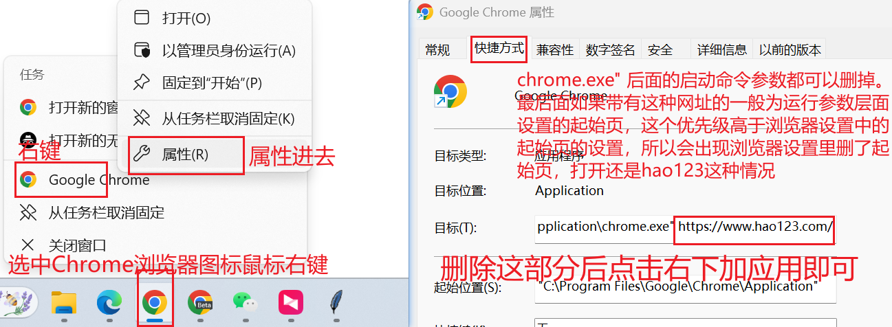

- [电脑小白的常识课](#电脑小白的常识课)
  - [一些常用软件](#一些常用软件)
  - [Windows安全中心添加排除项](#Windows安全中心添加排除项)
  - [浏览器起始页被篡改](#浏览器起始页被篡改)
- [系统教程](#系统教程)
  - [旧返利系统教程](#旧返利系统教程)
    - [登录下载](#登录下载)
    - [渠道区分](#渠道区分)
    - [产码流程](#产码流程)
  - [新返利系统教程](#新返利系统教程)
    - [登录下载](#登录下载)
    - [通道区分](#通道区分)
    - [卡密教程](#卡密教程)
    - [CK教程](#CK教程)
  - [星悦教程](#星悦教程)
  - [狐狸教程](#狐狸教程)
  - [返利公链接截图](#返利公链接截图)

---

# 电脑小白的常识课

## 一些常用软件

### 手机端 Google Authenticator

二步身份验证一律建议使用 Google Authenticator app来进行绑定，支持导出账号，其生成的二维码通过简单的编码可单独提取 gcode(secret) 参数，即使不直接提取 gcode(secret) 参数也可以使用其他设备的 Google Authenticator app扫描导出二维码进行绑定。如若使用小程序，则没有导出功能的

- [安卓手机下载链接](https://apkpure.com/cn/google-authenticator/com.google.android.apps.authenticator2)：默认下载的是最新版本，如若无法正常使用，请下拉下载历史版本。

- [苹果手机共享美区ID](https://jiesuo.xxappid.com/)：共享美区ID只需在App Store中登录 **切勿在系统设置中登录共享ID(iCloud)，否则有锁机风险** 
 [美区Google Authenticator](https://apps.apple.com/us/app/google-authenticator/id388497605)：点击链接即可跳转App Store下载，下载完成后记得退出共享美区ID账号
 

## Windows

软件

- [Notepad++](https://notepad-plus-plus.org/downloads/) [GitHub下载](https://github.com/notepad-plus-plus/notepad-plus-plus/releases "Notepad++官网正常情况打不开，可去GitHub进行下载")：一款比较好用的文本编辑器，个人用来替代Windows记事本
- [Bandizip](https://www.bandisoft.com/bandizip/)：一款免费的解压软件
- [Snipaste](https://zh.snipaste.com/)：一款简单但强大的截图+贴图工具
- [向日葵](https://sunlogin.oray.com/download)：远程控制软件
- [Chrome浏览器](https://www.google.com/intl/zh-CN/chrome/)：浏览器

脚本/补丁

- [RevokeMsgPatcher](https://github.com/huiyadanli/RevokeMsgPatcher/releases)：微信/QQ/TIM防撤回补丁

---

## Windows安全中心添加排除项

软件等被莫名杀毒，一般都是杀毒软件造成的，请先关闭（建议直接卸载）所有第三方杀毒软件，而后在Windows安全中心当中将其添加白名单

仅以Windows11系统为例，其他Windows系统可参考

## 浏览器起始页被篡改

**浏览器设置修改起始页网址**

**浏览器被恶意添加运行参数**

---

# 系统教程

## 旧返利系统教程

### 登录下载

### 渠道区分

**特殊回调 328/348/648 这三个金额，其他渠道回调 100-2000 之间整百金额**

如果遇到无赠送且链接固定挡位不是整百的游戏，可以选择使用强改插件（否则比如实付198且无赠送的情况下回调200，其实是有亏损的）

强改的原理是腾讯的游戏默认直接支付的话都是“xx点券*1”，其中1是数量，即默认份数（数量）都是1，所以我们可以通过修改请求参数中的 quantity(数量) 达到修改实付金额的目的。比如回调 100元，但是链接不能自定义且固定挡位当中没有 100，这个时候我们可以选择将数量修改为 100，这个时候我们选择固定挡位当中的 1元 挡位，就会变成实付 100元。

1. 强改注意点：有赠送游戏的强改后无赠送
2. 如何启用强改：勾选启用强改插件 + 修改强改后的数量

微信渠道支付方式选择**微信支付**，其他渠道支付方式均选择**QQ钱包**支付

预产阶段回调金额即系统需扣款的额度，填写的是单笔实际支付金额往上取。比如单笔实付198，那么回调金额应该往上取到200（就不能够去挂特殊渠道）

- ABCDE分别为不同的价格排序越后价格越贵速度越快
- TA=特殊A TB=特殊B
- VA=是微信的第一个渠道
- H是偶尔会开的低价

### 产码流程

通道管理（客户端）当中添加账号，随后去充值账号管理当中进行预产拉即可

- **手动产码**：预产 ——> 开启拉单 ——> 拉单
- **自动直拉**
   - **全自动产码**：预产 ——> 开启拉单、开启自动直冲（仅无畏契约、DNF端游、LOL端游、K歌、心悦无畏、三角洲）
   - **手动产码**：预产 ——> 开启拉单、开启自动直冲 ——> 等待弹窗手动拉码（需要确保有客户端登录，并且只有一个客户端开了自动弹窗）

> 首页：一般用于下载最新客户端，可查看部分历史版本的更新简述（网页端网址有变的话我会通知）
> 
> 充值账户管理：扫码或者自助链接录入上来的账号都会在这里显示，所有蓝色显示都可以双击进行修改
> 
> 下级账号管理：可以查看和设置下级的充值账户。如果你不是总台的话，也可在该页面给下级进行产码操作
> 
> 自助链接管理
> 
> 子账号管理：可查看自己的账户余额。手下级点添加码商，导出账单点快速对账（仅网页端支持导出）
> 
> 产码管理：你自己以及你所有下级所产出来的所有未失效码子均可在此查看。也可以点击QRCODE自己付款（一定要先关闭这个账号的拉单，否则系统100%强回）
> 
> 订单管理：这里可以查看余码以及每笔订单的支付情况。需要特别留意的是异常单，异常单系统不扣余额，需要额外记外账，折扣正常跟随渠道折扣走，部分情况原价，尽量不要刻意拉异常单
> 
> 活动链接管理：将自己的返利链接添加到这里，预产时就无需手动输入返利链接

## 新返利系统教程

### 登录下载

进入登录页面

绑定身份验证器

下载提CK软件

### 通道区分

用我的查价网址 [https://iiifox.me](https://iiifox.me) 可看到每个价格对应哪些通道可挂（鼠标悬停会显示）。

正常情况下：qb去qb通道；游戏有单独通道的去单独通道；游戏无单独通道的手游去腾讯综合、端游去腾讯端游。

### 卡密教程

首页或者通道管理当中找到你要挂的通道，如果右上角有**生成卡密**就说明该通道支持卡密，只需要点击生成卡密，随后复制卡密发给客户，让客户扫码录入即可

注意：卡密最后的ddh参数为**订单号**，所以批量添加卡密也是可以配合阿奇索自动发货的（与旧返利系统一样，订单号放在卡密链接最后）

### CK教程

## 星悦教程

## 狐狸教程

## 返利公链接截图
